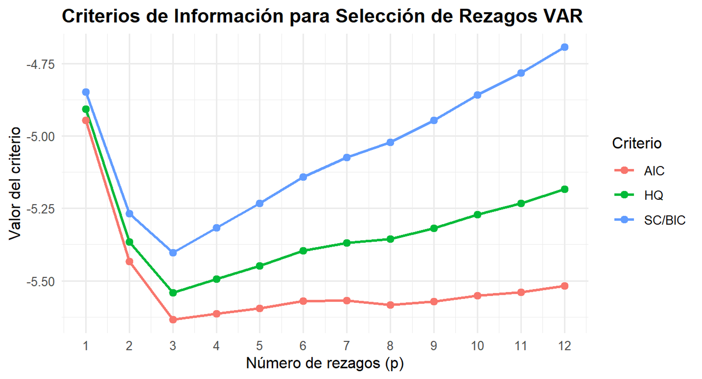
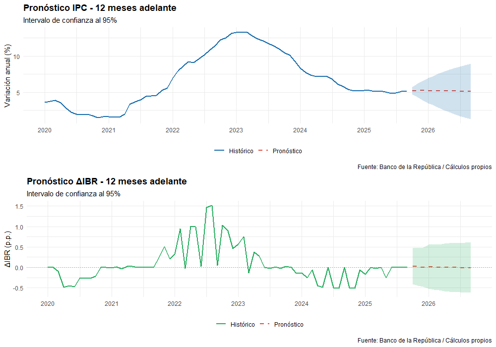
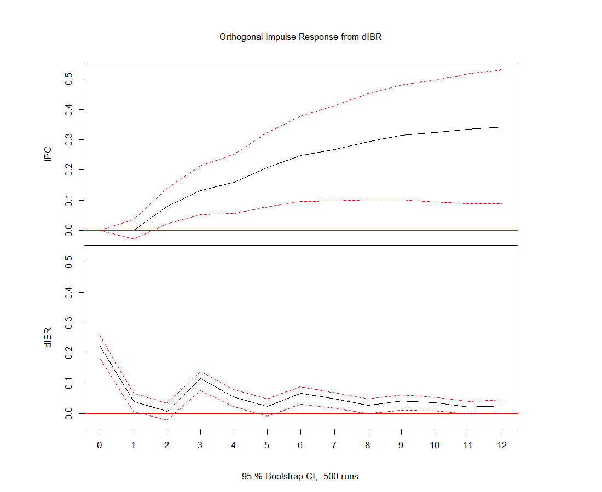
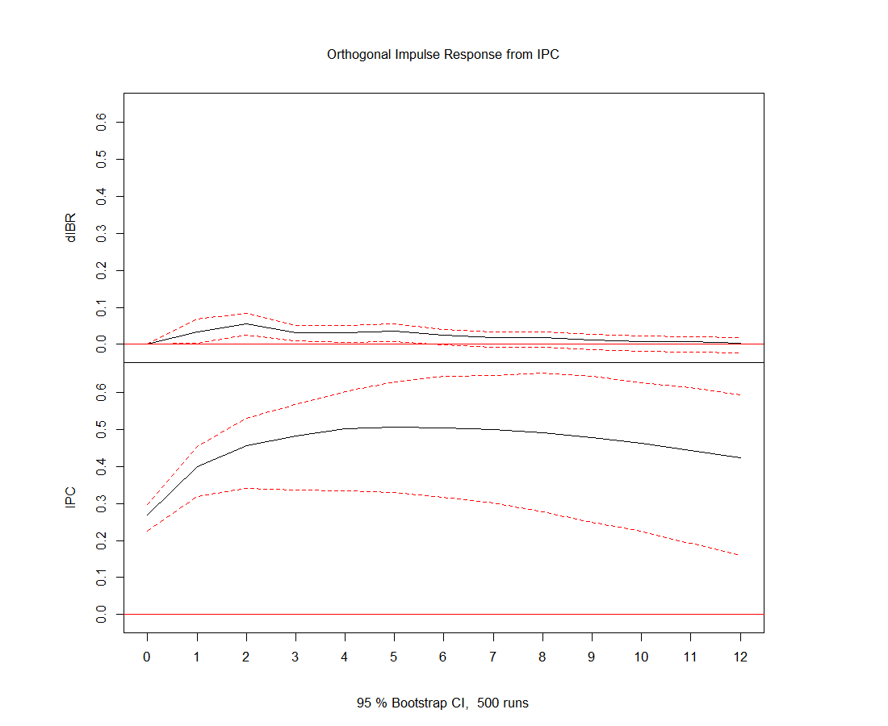

# VAR Model: Inflation and Monetary Policy in Colombia (2008–2025)

Analysis of the dynamic relationship between annual CPI inflation and the IBR overnight rate in Colombia using a Vector Autoregression (VAR) model. Data sourced from Banco de la República.

## Data
- Annual CPI variation (base year 2018): January 2008 – September 2025
- IBR overnight rate: daily frequency → monthly average → first difference
- Final dataset: ~213 monthly observations

> Data source: [Banco de la República](https://www.banrep.gov.co)

## Methodology
- Exploratory time series analysis
- Optimal lag selection: AIC, HQ, SC/BIC and FPE (up to 12 lags)
- VAR(3) estimation with constant term
- Model restriction via Tsay procedure (threshold |t| < 2)
- Stability check: all eigenvalues of companion matrix inside unit circle
- 12-month ahead forecasts with 95% confidence intervals
- Orthogonalized IRFs (Cholesky decomposition) under two variable orderings

## Key Results

### Information Criteria — Lag Selection


### 12-Month Forecasts


### Impulse Response Functions




## Main Findings
- All four information criteria selected p = 3 lags
- CPI equation: adjusted R² = 0.99; high inflation persistence confirmed
- ΔIBR equation: adjusted R² = 0.55; responds to lagged CPI (lag 1) 
  and its own lags (lags 1 and 3)
- Forecasts suggest CPI stabilizing around 5.1–5.2% through Sep 2026, 
  with near-zero ΔIBR indicating likely rate stability
- IRFs are sensitive to Cholesky ordering, highlighting the importance 
  of identification assumptions in structural interpretation

## Requirements
```r
install.packages(c("vars", "MTS", "ggplot2", "readxl", 
                   "lubridate", "zoo", "dplyr", "tidyr", 
                   "scales", "gridExtra"))
```

## Usage
Place `macroeconomic_data.xlsx` (sheets: IPC, IBR) in the working directory, 
then run `var_inflation_ibr.R`.

> Code comments are in Spanish, reflecting the academic context 
> in which this project was developed.
